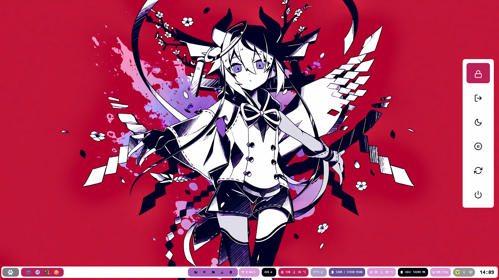
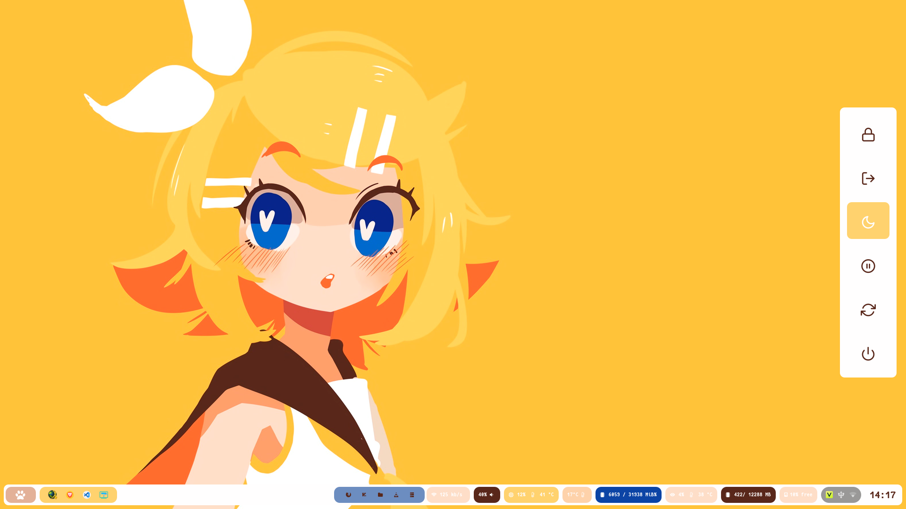
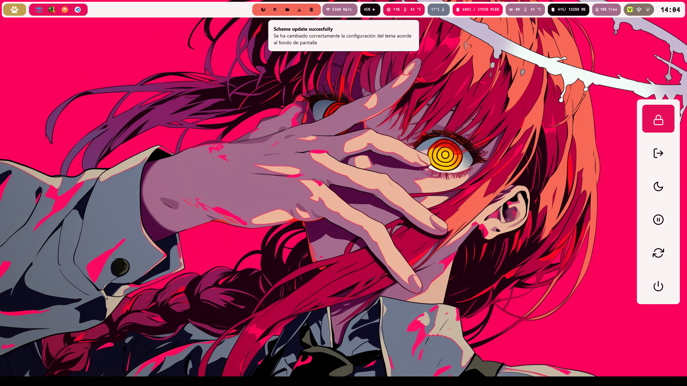

# Dotfiles

Bienvenid@ a mi configuración de Archlinux, al menos por el momento. Tratando de modernizar un poco la anterior ya que se vienen nuevos sistemas así que toca arreglar mi propio sistema a mi estilo, claro con la ayuda de muchos otros que compartieron sus configuraciones al igual que yo.



Toma con cuidado cada comando y no lo ejecutes todo a lo bastardo, no lo he hecho pensando en eso, sólo es una idea de que hacer luego de copiar los archivos a tu directorio home.

## Instalación

### ZSH

```sh
git clone https://github.com/zsh-users/zsh-syntax-highlighting.git ~/.oh-my-zsh/custom/plugins/
git clone https://github.com/zsh-users/zsh-autosuggestions ~/.oh-my-zsh/custom/plugins/
```

Luego editar

```
plugins=(git zsh-syntax-highlighting  zsh-autosuggestions  )
```

Se recomienda instalar para una mejor experiencia

```sh
pacman -S bat lsd fzf
```

### Hyprland

```sh
sudo pacman -S hyprcursor hyprgraphics hypridle hyprland hyprland-protocols hyprpaper hyprutils hyprsunset hyprpolkitagent hyprland-qtutils hyprlock hyprpicker
```

### Paquetes adicionales

```sh
sudo pacman -S waybar pacman-contrib lm_sensors pamixer grim slurp  rofi-wayland dunst xdg-desktop-portal-hyprland wl-clipboard playerctl wf-recorder xorg-wayland
```

```sh
yay -S waypaper wlogout eww
```

## Configuraciones

### Cambio automático de color con waypaper

Modificar la configuración de waypaper `~/.config/waypaper/config.ini`

```
post_command = ~/.bin/theme/wal.sh
```

## Atajos de teclado

Lanzar aplicaciones

| Tecla               | Acción                                      |
| ------------------- | ------------------------------------------- |
| `SUPER + E`         | Abrir **Nautilus** (explorador de archivos) |
| `SUPER + RETURN`    | Abrir **Kitty** (terminal)                  |
| `SUPER + T`         | Abrir **Kitty** (terminal)                  |
| `SUPER + SHIFT + N` | Script de notificaciones                    |
| `SUPER + M`         | Abrir **Rofi** (aplicaciones)               |
| `SUPER + Tab`       | Rofi (ventanas)                             |
| `SUPER + X`         | Powermenu (rofi)                            |

Espacios de trabajo

| Tecla                   | Acción                               |
| ----------------------- | ------------------------------------ |
| `SUPER + [1-0]`         | Cambiar a workspace 1–10             |
| `SUPER + SHIFT + [1-0]` | Mover ventana a workspace 1–10       |
| `SUPER + Next`          | Ir al siguiente workspace            |
| `SUPER + Prior`         | Ir al anterior workspace             |
| `SUPER + SHIFT + Next`  | Mover ventana al siguiente workspace |
| `SUPER + SHIFT + Prior` | Mover ventana al anterior workspace  |

Audio y multimedia

| Tecla                              | Acción              |
| ---------------------------------- | ------------------- |
| `XF86AudioMute`                    | Silenciar audio     |
| `XF86AudioMicMute`                 | Silenciar micrófono |
| `XF86AudioLowerVolume`             | Bajar volumen       |
| `XF86AudioRaiseVolume`             | Subir volumen       |
| `XF86AudioPlay` / `XF86AudioPause` | Play / Pause        |
| `XF86AudioNext`                    | Siguiente pista     |
| `XF86AudioPrev`                    | Pista anterior      |

Brillo y color

| Tecla                   | Acción                 |
| ----------------------- | ---------------------- |
| `XF86MonBrightnessUp`   | Subir brillo           |
| `XF86MonBrightnessDown` | Bajar brillo           |
| `SUPER + S`             | Activar **Nightlight** |

Capturas y grabación

| Tecla                   | Acción                     |
| ----------------------- | -------------------------- |
| `Print`                 | Captura de área (copiar)   |
| `SUPER + Print`         | Captura completa (guardar) |
| `SUPER + SHIFT + Print` | Captura completa (copiar)  |
| `SUPER + CTRL + Print`  | Captura de área (guardar)  |
| `SUPER + CTRL + R`      | Grabar pantalla completa   |
| `SUPER + CTRL + A`      | Grabar área                |
| `SUPER + CTRL + C`      | Detener grabación          |

Ventanas

| Tecla               | Acción                      |
| ------------------- | --------------------------- |
| `SUPER + F11`       | Pantalla completa           |
| `SUPER + W`         | Cerrar ventana activa       |
| `SUPER + F`         | Alternar flotante           |
| `SUPER + J`         | Alternar split              |
| `SUPER + R`         | Pseudo tile                 |
| `SUPER + L`         | Bloquear sesión (hyprlock)  |
| `SUPER + SHIFT + Q` | Matar sesión (`kill -9 -1`) |

Movimiento de ventanas

| Tecla                     | Acción                      |
| ------------------------- | --------------------------- |
| `SUPER + Flechas`         | Cambiar foco entre ventanas |
| `Alt + Tab`               | Cambiar foco (circular)     |
| `SUPER + SHIFT + Flechas` | Mover ventana en workspace  |
| `SUPER + LMB` (arrastrar) | Mover ventana               |
| `SUPER + RMB` (arrastrar) | Redimensionar ventana       |


## Estructura y funcionamiento

### Pywal

Toda la apariencia depende del script wal.sh

```sh
~/.bin/theme/wal.sh
```

Esto cambiará
- Waybar
- Kitty
- Rofi y Wlogout
- Hyprland
- Dunst
- Íconos GTK, por el momento sólo Tela-circle, eventualmente lo haré compatible con más paquetes de íconos multicolor.
- Luces RGB, para más fps

### Waybar

Puedes crear tu propio layout de waybar desde cli, esto no interfiere con el comportamiento de los módulos y el estilo del pánel.

```sh
python ~/.bin/theme/create-waybar.py \
--left "custom/launcher" "wlr/taskbar" \
--center "hyprland/workspaces" \
--right "custom/network" "pulseaudio" "custom/cpu" "temperature" "custom/memory" "custom/cuda" "custom/vram" "disk" "tray" "clock" \
--position bottom \
--margin 8
```

Luego de eso inicias waybar normalmente, aunque ya hay un script que lo hace

```sh
killall waybar -q
waybar &
```



### Cambiar tema oscuro a claro o vicebersa

Sólo con un click derecho en el logo de waybar y cambiará todo al tema opuesto. Sólo aquello que dependa directamente de pywal.

```sh
~/.bin/theme/toggle-theme.sh
```

