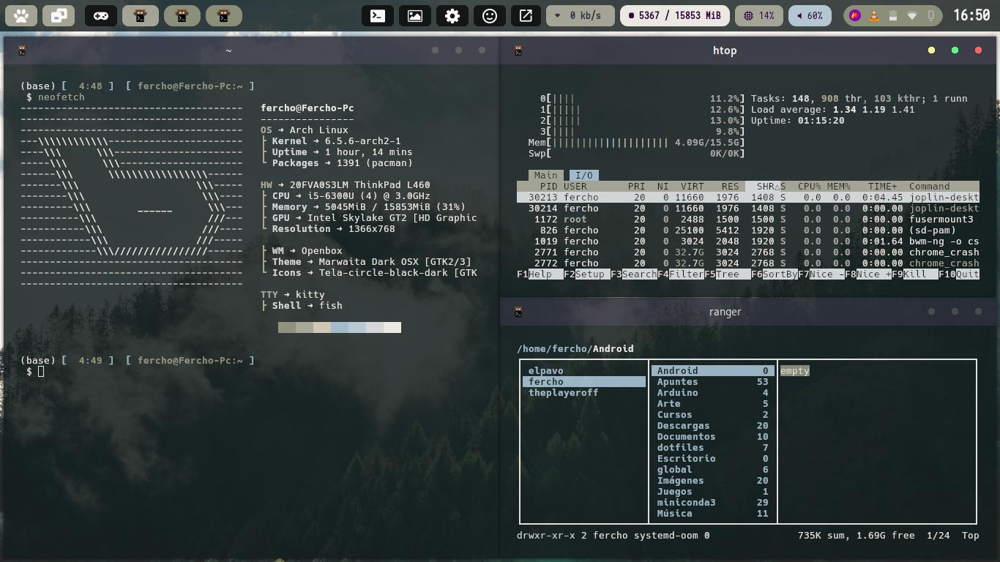
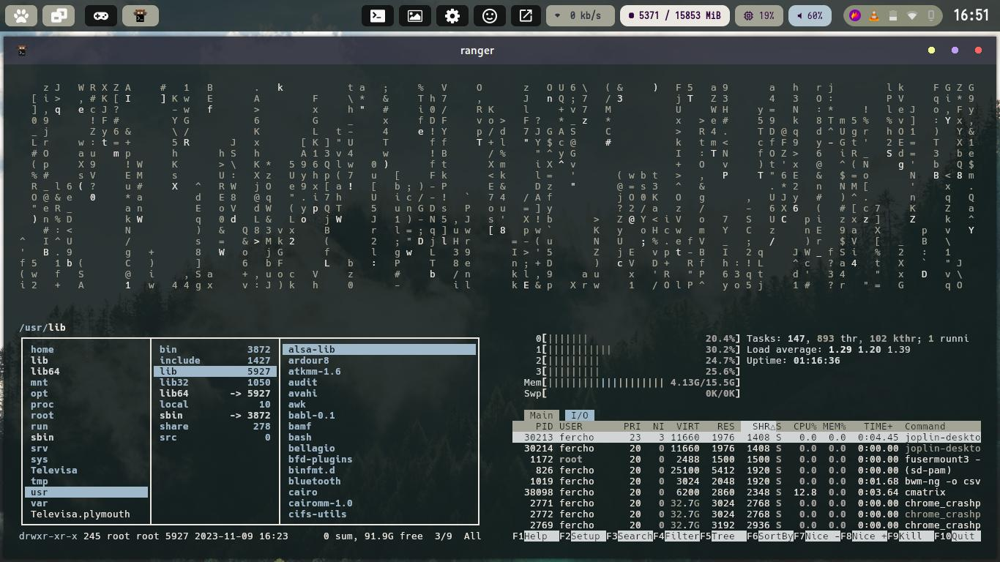
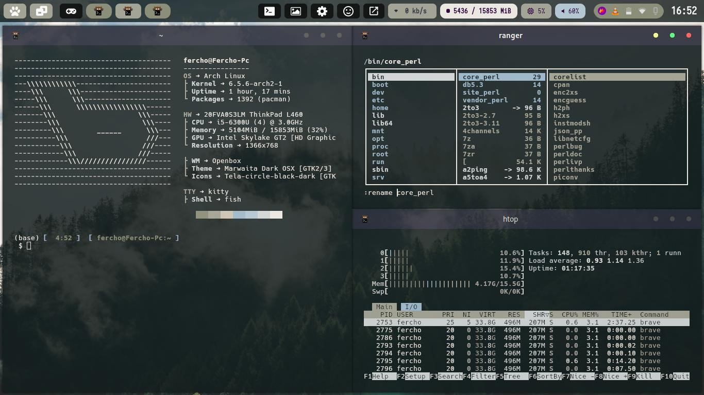

# Dotfiles

Welcome to my linux configuration, this is my the newest config on Archlinux and Openbox as main distro an desktop respectably.

- Almost all the configurations has been tested on distros like Arch, Fedora and Bedrock Linux.
- The configured **window managers** are : **i3**, **bspwm**, **sway**, and **openbox** the others doesn't have been configured, the main wm now obviusly openbox.
- **terminal:** [kitty](https://sw.kovidgoyal.net/kitty/)
- **compositor:** picom
- **Shell:** zsh with [oh-my-zsh](https://ohmyz.sh/)
- **launcher:** rofi with themes based on [this](https://github.com/adi1090x/rofi)
- **Pannels:** tint2 based on [this](https://github.com/owl4ce/dotfiles), waybar or i3blocks.
- **screenshots and wallpapers**: flameshot and nitrogen
- **Themes** : I use [pywal](https://github.com/dylanaraps/pywal) for wallpaper and terminal color matching.

## Screenshots





## Installation

You must find the program that you need the configuration, you'll need enter to the config folder and you can copy the code, but you have to been sure that you make the adaptations for your hardware. The Dotfiles are not an extra layer that you can install with a simple script, no for now, maybe in the future I can do that, but not for now :(

## Before enjoy

Make you sure that you have the applications and fonts installed, or change my config with your applications and fonts.

### Dependencies
- bspwm
- sxhkd
- i3
- sway
- openbox
- obconfig
- obmenu generator
- nitrogen
- nomacs (opt)
- flameshot 
- neovim (opt)
- rofi

## Keybindings
| key | action |
|-----|--------|
| mod+m | Open app launcher |
| mod+r | Run a command |
| mod+return | Open a terminal |
| mod+Print | Take full screenshot |
| Print | Open the screenshot app (flameshot) in gui mode |
| mod+e | open file explorer |
| mod+F5 | Turn on the nightlight | 
| mod+F6 | Turn off the nightlight |
| mod+x | Open the powermenu |

## Pannel settings

The Best pannel for Xorg is Tint2, and the best for wayland is waybar.

**Fonts Needed**
- Iosevka Nerd Font
- Cantarell
- SpaceMono Nerd Font

### Tint2

If you want to change the tint2 orientation, you have to edit the autostart.sh on the .bin folder replacing the next, the colors are generated by the script with pywal.

```sh
	if [ $($(pgrep tint2)) ]; then
		killall -q tint2
	else
		bash ~/.config/tint2/tint2.sh vertical &
	fi
```
