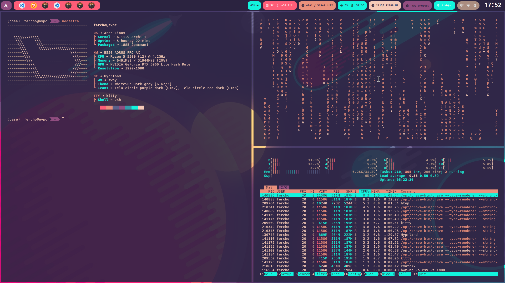
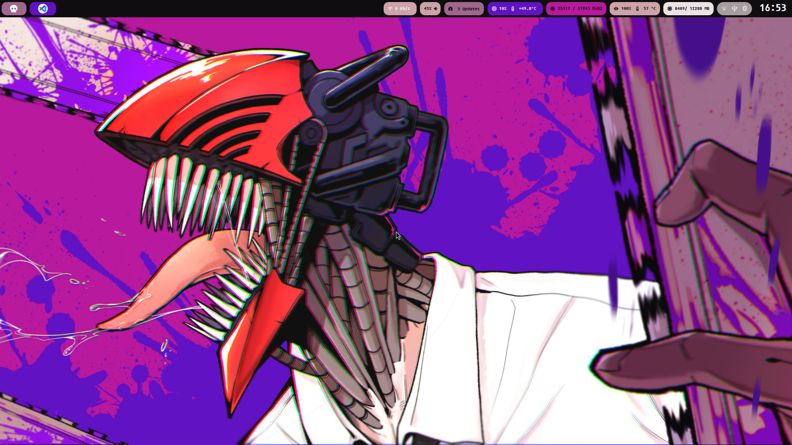
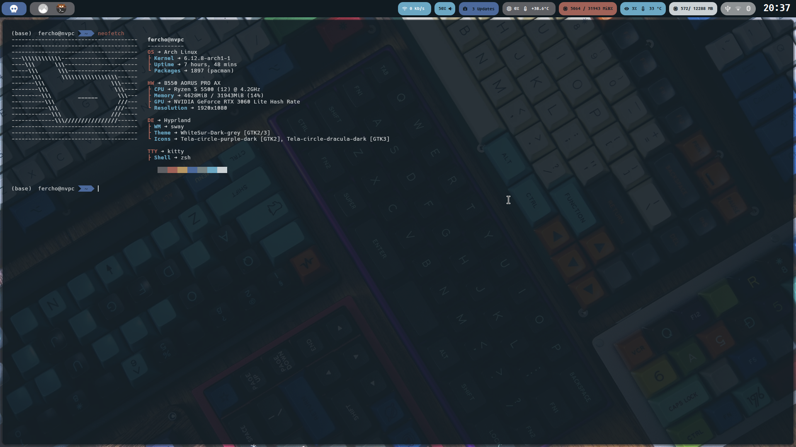

# Dotfiles

Welcome to my linux configuration, this is my the newest config on Archlinux and Hyprland as main window manager.

- All the configurations has been tested on Arch.
- The configured **window managers** are : **i3**, **bspwm**, **sway**, **openbox** and **hyprland** (this is my new manin)
- **terminal:** [kitty](https://sw.kovidgoyal.net/kitty/)
- **Shell:** zsh with [oh-my-zsh](https://ohmyz.sh/)
- **launcher:** rofi with themes based on [this](https://github.com/adi1090x/rofi)
- **Pannels:** waybar based on previous config with tint2
- **screenshots and wallpapers**: grim, slurp
- **Themes** : I use [pywal](https://github.com/dylanaraps/pywal) for wallpaper and terminal color matching.

## Screenshots

## Installation

You must find the program that you need the configuration, you'll need enter to the config folder and you can copy the code, but you have to been sure that you make the adaptations for your hardware. The Dotfiles are not an extra layer that you can install with a simple script, no for now, maybe in the future I can do that, but not for now :(

## Keybindings
| key | action |
|-----|--------|
| mod+m | Open app launcher |
| mod+r | Run a command |
| mod+return | Open a terminal |
| mod+Print | Take full screenshot |
| Print | Open the screenshot app (flameshot) in gui mode |
| mod+e | open file explorer |
| mod+F5 | Turn on the nightlight | 
| mod+F6 | Turn off the nightlight |
| mod+x | Open the powermenu |

## Pannel settings

The Best pannel for Xorg is Tint2, and the best for wayland is waybar.

**Fonts Needed**
- Iosevka Nerd Font
- Cantarell
- SpaceMono Nerd Font