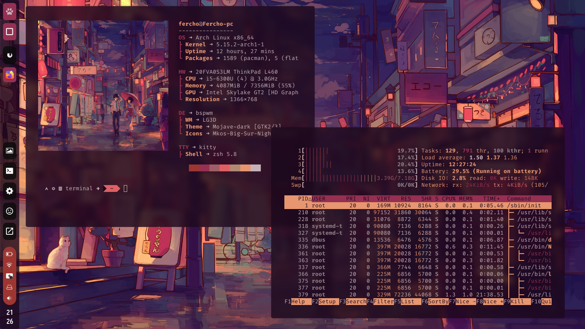

# Dotfiles

- The configurations was tested on the **Distributions** : Fedora, Arch, Debian and Bedrock.
- The **window managers** used were : **i3**, **bspwm**, **sway**, the others doesn't have been configured, the main wm is obviusly bspwm.
- **terminal:** [kitty](https://sw.kovidgoyal.net/kitty/)
- **compositor:** [picom-rounded-corners](https://aur.archlinux.org/packages/picom-rounded-corners/)
- **Shell:** zsh with [oh-my-zsh](https://ohmyz.sh/)
- **launcher:** rofi with themes based on [this](https://github.com/adi1090x/rofi)
- **Pannels:** tint2 based on [this](https://github.com/owl4ce/dotfiles), waybar or i3blocks.
- **screenshots and wallpapers**: flameshot and nitrogen
- **Themes** : I use [pywal](https://github.com/dylanaraps/pywal)

## Screenshots



## Installation

You must find the program that you need the configuration, youll enter to the config folder and you can copy the code, but you have to been sure that you make the adaptatios for your hardware, the dotfiles are not an extra layer that you can install with a simple script, no for now, maybe in the future i can do that, but not for now :(

## Before enjoy

Make you sure that you have the applications and fonts installed, or change my config with your applications and fonts.

### Dependencies
- bspwm
- sxhkd
- i3
- sway
- nitrogen
- nomacs (opt)
- flameshot 
- neovim (opt)
- rofi

## Keybindings
| key | action |
|-----|--------|
| mod+m | open app launcher |
| mod+Shift+m | open run promt |
| mod+return | open a terminal |
| mod+Print | Open screenshot menu |
| Print | quick screenshot to .screenshots/ |
| mod+e | open file explorer |
| mod+n | open network widget| 
| mod+f | float current window |
| mod+F11 | toggle fullscreen window |

## Pannel settings

### i3blocks
you have 3 choises:

**Text and icons**

Use the SpaceMono NF for look better and picom without blur

**Powerline static**

i3blocks powerline stable and customisable but static colors.

**Powerline dynamic (experimental)**

I made an script that use JSON format themes for styling the bar but sometimes have errors with the storage indicator.

### Tint2

If you want to change the tint2 horientation, you have to edit the autostart.sh on the .bin folder replacing the next, the colors are generated by the script with pywal.

```sh
	if [ $($(pgrep tint2)) ]; then
		killall -q tint2
	else
		bash ~/.config/tint2/tint2.sh vertical &
	fi
```
